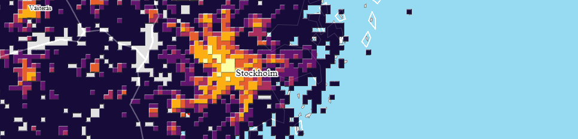

# leaflet-gridviz


<div>
    <a href="https://eurostat.github.io/leaflet-gridviz/examples/demo.html" target="_blank">
        
    </a>
</div>

A plugin for Leaflet to show [gridviz](https://github.com/eurostat/gridviz) maps.

## Demo

[Population census gridviz layer in leaflet](https://eurostat.github.io/leaflet-gridviz/examples/demo.html) | [see code](./examples/demo.html)

## Usage

```JavaScript
// import leaflet-gridviz after importing leaflet
<script src="https://www.unpkg.com/leaflet-gridviz"></script>

// create your leaflet map
var map = new L.Map('map', {
    crs: crs,
    center: ['50.00754', '19.98211'],
})

// define your leaflet-gridviz layer
let gridvizLayer = new L.GridvizLayer({
    proj: 'EPSG:3035',
    onLayerDidMountCallback: (gridvizMap) => {
        //define multi resolution dataset
        const dataset = new gridviz.MultiResolutionDataset(
            //the resolutions
            [1000, 2000, 5000, 10000, 20000, 50000, 100000],
            //the function returning each dataset from the resolution
            (resolution) =>
                new gridviz.TiledGrid(
                    gridvizMap,
                    'https://raw.githubusercontent.com/jgaffuri/tiledgrids/main/data/europe/population2/' +
                        resolution +
                        'm/'
                )
        )

        //define color for each cell c
        const colorFunction = (cell, resolution) => {
            const density = (1000000 * cell.TOT_P_2021) / (resolution * resolution)
            if (density > 1500) return '#993404'
            else if (density > 600) return '#d95f0e'
            else if (density > 200) return '#fe9929'
            else if (density > 60) return '#fec44f'
            else if (density > 15) return '#fee391'
            else return '#ffffd4'
        }

        //define style
        const style = new gridviz.ShapeColorSizeStyle({ color: colorFunction })

        //add layer to map
        gridvizMap.layers = [new gridviz.GridLayer(dataset, [style], {minPixelsPerCell: 5})]

        //custom opacity
        gridvizLayer._canvas.style.opacity = 0.7
    },
})

// add it to the map
gridvizLayer.addTo(map)


```

Note: this has only been tested with EPSG:3035 grids

Feel free to contribute or open an issue!

## Installation for development

With node.js 14.20.1:

`npm install`  
`npm start`
